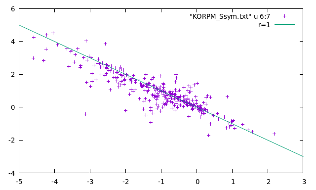

# korpm

Fast prediction the stability from 3D strcuture

## Usage 

The usage is very simple:  

```sh
>bin/korpm input.txt --dir Ssym --score_file pot/korp6Dv1.bin -o out.txt
```
it only requires: 1) two column input file specifying both PDB file and mutation and 2) the paths the PDB files (--dir) and the KORP potential file (--score_file).  The results are also stored in the out.txt (-o option) file.

```sh
>more out.txt
1BNI IA76A       -1.466
1EY0 TA44V        0.107
1IHB FA82Q       -0.739
```
The mutation columns stands for: 1st letter is the wild type amino acid, 2nd is the chain ID, digits corresponds to PDB residue positon, and the last letter is the mutated amino acid. We follow the standard convention ΔΔG >= 0 (positives) are stabilizing and ΔΔG < 0 (negatives) are destabilizing.

## ΔΔG Curated Databases

We extracted from [Thermomut](http://biosig.unimelb.edu.au/thermomutdb/) and [ProThermDB](https://web.iitm.ac.in/bioinfo2/prothermdb/index.html)

<table border="0">

 <tr>
    <td>
       </td>
    <td> 
        </td>
 </tr>
  <tr>
    <td><b style="font-size:30px">Title</b></td>
    <td><b style="font-size:30px">Title 2</b></td>
 </tr></table>

## Results with Ssym


```sh
>bin/korpm Pucci2018N.txt --dexp --dir Ssym --score_file pot/korp6Dv1.bin -o Ssym_all.txt
```

get some statistics 

```sh
/Mstat.pl Ssym_all.txt 10 11 2

# Current Positives|Negatives threshold (thr) is 0 (ddG >= 0 are not-destabilizing [positives] and ddG < 0 are destabilizing [negatives]).

aa     #     S     D     T   TP  avg  err   FP   TN  avg  err   FN   NC    P     N    TPR   FPR   SPE   PPV   NPV   ACC   ERR  accn  RMSE   MAE    PCC    Sc   Ob1   Ob2   MCC
 X   684   342   342   684  263  1.5  0.9   72  270 -1.5  0.8   79    0   335   349 0.769 0.211 0.789 0.785 0.774 0.779 0.221 0.779 1.339 0.975  0.694  63.7  35.5   0.7  0.56
 A   194    97    97   194   81  1.8  0.9   15   82 -1.9  0.9   16    0    96    98 0.835 0.155 0.845 0.844 0.837 0.840 0.160 0.840 1.527 1.087  0.743  67.0  32.0   1.0  0.68
 V   212   106   106   212   83  1.2  0.8   25   81 -1.2  0.8   23    0   108   104 0.783 0.236 0.764 0.769 0.779 0.774 0.226 0.774 1.205 0.889  0.688  63.2  36.8   0.0  0.55
 I   136    68    68   136   57  1.6  0.8   12   56 -1.6  0.7   11    0    69    67 0.838 0.176 0.824 0.826 0.836 0.831 0.169 0.831 1.146 0.897  0.811  66.2  32.4   1.5  0.66
 L    82    41    41    82   29  1.6  0.9   12   29 -1.7  1.0   12    0    41    41 0.707 0.293 0.707 0.707 0.707 0.707 0.293 0.707 1.513 1.122  0.639  61.0  39.0   0.0  0.41
 M    78    39    39    78   32  1.3  0.9    8   31 -1.3  0.9    7    0    40    38 0.821 0.205 0.795 0.800 0.816 0.808 0.192 0.808 1.193 0.972  0.721  57.7  42.3   0.0  0.62
 F    70    35    35    70   28  1.2  1.1    7   28 -1.3  1.1    7    0    35    35 0.800 0.200 0.800 0.800 0.800 0.800 0.200 0.800 1.697 1.215  0.560  58.6  41.4   0.0  0.60
 W     6     3     3     6    3  3.5  2.4    0    3 -3.5  1.8    0    0     3     3 1.000 0.000 1.000 1.000 1.000 1.000 0.000 1.000 2.291 2.137  0.978  66.7  33.3   0.0  1.00
 Y    38    19    19    38   14  1.4  1.3    4   15 -1.8  1.2    5    0    18    20 0.737 0.211 0.789 0.778 0.750 0.763 0.237 0.763 1.896 1.364  0.609  71.1  28.9   0.0  0.53
 R    40    20    20    40   19  1.9  1.2    2   18 -2.0  1.0    1    0    21    19 0.950 0.100 0.900 0.905 0.947 0.925 0.075 0.925 1.456 1.080  0.794  75.0  25.0   0.0  0.85
 H    12     6     6    12    4  1.7  0.7    3    3 -2.1  0.4    2    0     7     5 0.667 0.500 0.500 0.571 0.600 0.583 0.417 0.583 1.193 0.857  0.788  66.7  33.3   0.0  0.17
 K    34    17    17    34   12  1.4  1.0    3   14 -1.5  1.1    5    0    15    19 0.706 0.176 0.824 0.800 0.737 0.765 0.235 0.765 1.593 1.032  0.695  67.6  32.4   0.0  0.53
 D    56    28    28    56   14  1.4  1.0   14   14 -1.4  0.7   14    0    28    28 0.500 0.500 0.500 0.500 0.500 0.500 0.500 0.500 1.512 1.234  0.366  50.0  50.0   0.0  0.00
 E    32    16    16    32    8  0.9  0.5    7    9 -0.8  0.5    8    0    15    17 0.500 0.438 0.562 0.533 0.529 0.531 0.469 0.531 0.712 0.605  0.722  84.4  15.6   0.0  0.06
 S    90    45    45    90   36  1.0  0.6   10   35 -1.1  0.5    9    0    46    44 0.800 0.222 0.778 0.783 0.795 0.789 0.211 0.789 0.880 0.630  0.765  70.0  27.8   2.2  0.58
 T   106    53    53   106   40  1.4  0.7   11   42 -1.4  0.7   13    0    51    55 0.755 0.208 0.792 0.784 0.764 0.774 0.226 0.774 0.973 0.806  0.756  53.8  45.3   0.9  0.55
 N    48    24    24    48   16  1.2  0.9    7   17 -1.2  0.8    8    0    23    25 0.667 0.292 0.708 0.696 0.680 0.688 0.312 0.688 1.277 0.949  0.581  60.4  39.6   0.0  0.38
 Q    18     9     9    18    7  0.9  0.5    1    8 -0.8  0.6    2    0     8    10 0.778 0.111 0.889 0.875 0.800 0.833 0.167 0.833 0.751 0.623  0.743  66.7  33.3   0.0  0.67
 C    28    14    14    28   12  1.7  0.9    1   13 -1.9  1.0    2    0    13    15 0.857 0.071 0.929 0.923 0.867 0.893 0.107 0.893 1.780 1.287  0.630  64.3  28.6   7.1  0.79
 G    60    30    30    60   22  1.7  0.8    1   29 -1.6  0.8    8    0    23    37 0.733 0.033 0.967 0.957 0.784 0.850 0.150 0.850 1.438 0.985  0.763  61.7  38.3   0.0  0.72
 P    28    14    14    28    9  1.4  0.9    1   13 -1.2  0.6    5    0    10    18 0.643 0.071 0.929 0.900 0.722 0.786 0.214 0.786 1.202 0.866  0.649  67.9  28.6   3.6  0.60
```

### Check ΔΔG Anti-symmetry in Ssym

```sh
bin/korpm Pucci2018dirN.txt --dexp --dir Ssym --score_file pot/korp6Dv1.bin -o Ssym_dir.txt
bin/korpm Pucci2018revN.txt --dexp --dir Ssym --score_file pot/korp6Dv1.bin -o Ssym_rev.txt
paste Ssym_dir.txt  Ssym_rev.txt  > temp
awk 'function abs(x){return (x < 0) ? -x : x;} {printf "%s %s %s %s %s %s %s %f  %f %s %s\n",$1,$19, $2, $20, $10, $11,$29, ($11+$29), abs(($11+$29)), $3, $4  }' temp > KORPM_Ssym.txt
```

you can see the results in your favority plot, for example in gnuplot:


<table border="0">
 <tr>
    <td><b style="font-size:30px">Title</b></td>
    <td><b style="font-size:30px">Title 2</b></td>
 </tr>
 <tr>
    <td><pre>plot  "KORPM_Ssym.txt" u 6:7
     stat "KORPM_Ssym.txt" u 6:7
     ...
     Linear Model:       y = -0.8267 x + 0.03372
     Slope:              -0.8267 +- 0.02426
     Intercept:          0.03372 +- 0.03814
     Correlation:        r = -0.8795
     ...</pre>
  </td>
    <td> 
        </td>
 </tr>
</table>
### Comparative results Ssym

Here you can find some compartive results with state of the art stability prediction programs:

```sh
              #     S     D     T   TP  avg  err   FP   TN  avg  err   FN   NC    P     N    TPR   FPR   SPE   PPV   NPV   ACC   ERR  accn  RMSE   MAE    PCC    Sc   Ob1   Ob2   MCC #   AUC_R   AUC_P   T
HROC    TPR     FPR     BMCC    TH      TPR     FPR
KORPM   X   684   342   342   684  264  1.5  0.9   72  270 -1.5  0.8   78    0   336   348 0.772 0.211 0.789 0.786 0.776 0.781 0.219 0.781 1.324 0.959  0.696  64.3  34.9   0.7  0.56 #   0.858   0.854  -0
.056   0.807   0.222   0.585  -0.056   0.807   0.222
Cartddg X   684   342   342   684  197  1.4  1.6   43  299 -1.5  2.9  145    0   240   444 0.576 0.126 0.874 0.821 0.673 0.725 0.275 0.725 3.438 2.633  0.633  52.3  41.1   6.6  0.47 #   0.809   0.815  -0
.859   0.713   0.208   0.507  -0.859   0.713   0.208
FoldX   X   684   342   342   684  188  1.4  0.8   77  265 -1.5  1.0  154    0   265   419 0.550 0.225 0.775 0.709 0.632 0.662 0.338 0.662 1.862 1.286  0.537  60.1  34.5   5.4  0.33 #   0.736   0.748  -0
.258   0.635   0.292   0.371   0.151   0.526   0.173
Evo     X   684   342   342   684  209  1.4  0.8  102  240 -1.5  0.9  133    0   311   373 0.611 0.298 0.702 0.672 0.643 0.656 0.344 0.656 1.562 1.123  0.543  61.7  34.9   3.4  0.31 #   0.741   0.753  -0
.106   0.681   0.325   0.359   0.248   0.535   0.190
PopMs   X   684   342   342   684  229  1.4  1.0  100  242 -1.5  1.1  113    0   329   355 0.670 0.292 0.708 0.696 0.682 0.689 0.311 0.689 1.581 1.147  0.521  56.6  42.4   1.0  0.38 #   0.755   0.738   0
.001   0.670   0.292   0.404   0.262   0.488   0.117
Dynamut X   684   342   342   684   72  1.5  1.2   40  302 -1.4  0.8  270    0   112   572 0.211 0.117 0.883 0.643 0.528 0.547 0.453 0.547 1.879 1.368  0.380  54.4  38.2   7.5  0.13 #   0.624   0.616  -0
.701   0.629   0.474   0.238  -1.848   0.944   0.781
DDGun3D X   684   342   342   684  233  1.4  0.9  105  237 -1.4  0.9  109    0   338   346 0.681 0.307 0.693 0.689 0.685 0.687 0.313 0.687 1.434 1.039  0.627  61.8  37.4   0.7  0.37 #   0.753   0.756  -0
.006   0.696   0.316   0.380   0.011   0.673   0.292
TherNet X   684   342   342   684  223  1.5  1.0  102  240 -1.5  1.0  119    0   325   359 0.652 0.298 0.702 0.686 0.669 0.677 0.323 0.677 1.531 1.093  0.551  58.2  40.9   0.9  0.35 #   0.745   0.742   0
.002   0.652   0.298   0.375   0.063   0.588   0.219
```


