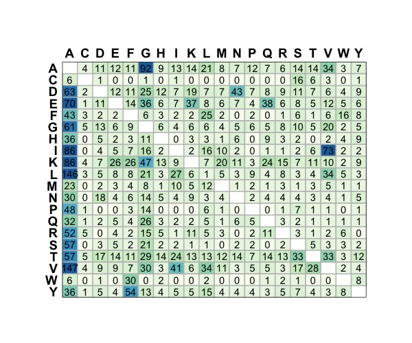
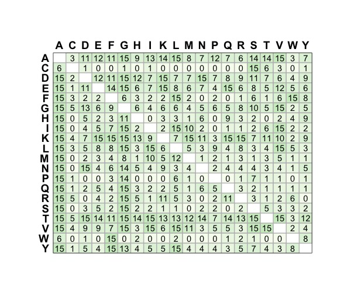
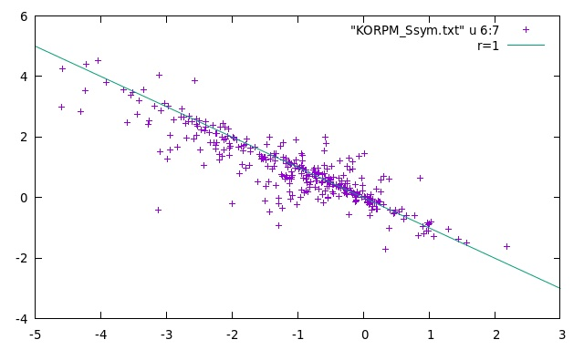

# korpm

Fast method for predicting the stability change upon mutation from 3D structure. Predicting protein stability changes upon mutation using a simple orientational potential. I. Martín-Hernández, Y. Dehouck, U. Bastolla, J.R. López-Blanco and P. Chacón (submitted).

## Usage 

The usage is very simple:  

```sh
sbg/bin/korpm input.txt --dir Ssym --score_file pot/korp6Dv1.bin -o out.txt
```
it only requires: 1) two column input file specifying both PDB file and mutation, i.e. 1BNI IA76A  and 2) the path where the PDB files are located (--dir) and the KORP potential file (--score_file).  The results are also stored in the out.txt (-o option) file.

```sh
more out.txt
1BNI IA76A       -1.452
1EY0 TA44V        0.107
1IHB FA82Q       -0.739
```
The mutation columns stands for: 1st letter is the wild type amino acid, 2nd is the chain ID, digits corresponds to PDB residue position, and the last letter is the mutated amino acid. We follow the standard convention ΔΔG >= 0 (positives) are stabilizing and ΔΔG < 0 (negatives) are destabilizing.

## ΔΔG Curated Databases

We extracted from [Thermomut](http://biosig.unimelb.edu.au/thermomutdb/) and [ProThermDB](https://web.iitm.ac.in/bioinfo2/prothermdb/index.html) unique mutations trying to avoid entries that potentially interact with ligands or belong to a protein-protein interfaces, and removing entries measured at extreme temperature or pH conditions. The initial curated database data comprise 3766 mutations from 149 proteins families (homology <50%) with an average of ΔΔG -1.0 Kcal/mol and a standard deviation of 1.6 Kcal/mol. In total, 73% are destabilizing (ΔΔG>0) and 27% are stabilizing (ΔΔG<0). By removing mainly alanines' destabilizing mutations, we obtain a more balanced subset that includes 2344 mutations from 137 proteins families, 58% destabilizing and 42% stabilizing with an average of ΔΔG -0.7 Kcal/mol and a standard deviation of 1.6 Kcal/mol. This subset, named [Id50c08_1merNCLB.txt](Id50c08_1merNCLB.txt), was used for extract training and validation datasets for k-fold cross-validation experiments. Note that this subset is far from being perfectly balanced, e.g., the most frequent amino acid involved in the mutation still is alanine and cysteines, tryptophans, and, prolines still are underpopulated. 

<table border="0">

 <tr>
    <td>
       </td>
    <td> 
        </td>
 </tr>
  <tr>
    <td align="center" ><b style="font-size:30px"><a href="Id30c08_1merNCL.txt">Id30c08_1merNCL.txt</a> </b></td>
    <td align="center" ><b style="font-size:30px"><a href="Id30c08_1merNCLB.txt">Id30c08_1merNCLB.txt</a> </b></td>
 </tr></table>

In the directory [Db](Db) you can find all the correspond PDB files. 

## Results with Ssym

Ssym is a data set with equal number of stabilizing and destabilizing mutations compiled by Pucci et al. (https://doi.org/10.1093/bioinformatics/bty348) for which the structure of both the wild-type and mutant protein are available.  

```sh
sbg/bin/korpm Pucci2018N.txt --dexp --dir Ssym --score_file pot/korp6Dv1.bin -o Ssym_all.txt
```
Where [Pucci2018N.txt](Pucci2018N.txt) is the mutations input file and the [Ssym](Ssym) directory in where the input PDB files are store. Since this input contains the experimental ΔΔG (see Appendix for small corrections) you can cross-check the predictions by: 
```sh
scripts/Mstat.pl Ssym_all.txt 10 11 2
```
<pre><table border="1">
<tr><td>aa</td><td>TPR</td><td>SPE</td><td>PPV</td><td>NPV</td><td>ACC</td><td>RMSE</td><td>MAE</td><td>PCC</td><td>Sc</td><td>Ob1</td><td>Ob2</td><td>MCC</td><td>T</td><td>TP</td><td>avg</td><td>err</td><td>FP</td><td>TN</td><td>avg</td><td>err</td><td>FN</td><td>P</td><td>N</td></tr>
<tr><td>X</td><td>0.77</td><td>0.79</td><td>0.79</td><td>0.77</td><td>0.78</td><td>1.34</td><td>0.98</td><td>0.69</td><td>63.7</td><td>35.5</td><td>0.7</td><td>0.56</td><td>684</td><td>263</td><td>1.5</td><td>0.9</td><td>72</td><td>270</td><td>-1.5</td><td>0.8</td><td>79</td><td>335</td><td>349</td></tr>
<tr><td>A</td><td>0.84</td><td>0.85</td><td>0.84</td><td>0.84</td><td>0.84</td><td>1.53</td><td>1.09</td><td>0.74</td><td>67</td><td>32</td><td>1</td><td>0.68</td><td>194</td><td>81</td><td>1.8</td><td>0.9</td><td>15</td><td>82</td><td>-1.9</td><td>0.9</td><td>16</td><td>96</td><td>98</td></tr>
<tr><td>V</td><td>0.78</td><td>0.76</td><td>0.77</td><td>0.78</td><td>0.77</td><td>1.21</td><td>0.89</td><td>0.69</td><td>63.2</td><td>36.8</td><td>0</td><td>0.55</td><td>212</td><td>83</td><td>1.2</td><td>0.8</td><td>25</td><td>81</td><td>-1.2</td><td>0.8</td><td>23</td><td>108</td><td>104</td></tr>
<tr><td>I</td><td>0.84</td><td>0.82</td><td>0.83</td><td>0.84</td><td>0.83</td><td>1.15</td><td>0.90</td><td>0.81</td><td>66.2</td><td>32.4</td><td>1.5</td><td>0.66</td><td>136</td><td>57</td><td>1.6</td><td>0.8</td><td>12</td><td>56</td><td>-1.6</td><td>0.7</td><td>11</td><td>69</td><td>67</td></tr>
<tr><td>L</td><td>0.71</td><td>0.71</td><td>0.71</td><td>0.71</td><td>0.71</td><td>1.51</td><td>1.12</td><td>0.64</td><td>61</td><td>39</td><td>0</td><td>0.41</td><td>82</td><td>29</td><td>1.6</td><td>0.9</td><td>12</td><td>29</td><td>-1.7</td><td>1</td><td>12</td><td>41</td><td>41</td></tr>
<tr><td>M</td><td>0.82</td><td>0.80</td><td>0.80</td><td>0.82</td><td>0.81</td><td>1.19</td><td>0.97</td><td>0.72</td><td>57.7</td><td>42.3</td><td>0</td><td>0.62</td><td>78</td><td>32</td><td>1.3</td><td>0.9</td><td>8</td><td>31</td><td>-1.3</td><td>0.9</td><td>7</td><td>40</td><td>38</td></tr>
<tr><td>F</td><td>0.80</td><td>0.80</td><td>0.80</td><td>0.80</td><td>0.80</td><td>1.70</td><td>1.22</td><td>0.56</td><td>58.6</td><td>41.4</td><td>0</td><td>0.6</td><td>70</td><td>28</td><td>1.2</td><td>1.1</td><td>7</td><td>28</td><td>-1.3</td><td>1.1</td><td>7</td><td>35</td><td>35</td></tr>
<tr><td>W</td><td>1.00</td><td>1.00</td><td>1.00</td><td>1.00</td><td>1.00</td><td>2.29</td><td>2.14</td><td>0.98</td><td>66.7</td><td>33.3</td><td>0</td><td>1</td><td>6</td><td>3</td><td>3.5</td><td>2.4</td><td>0</td><td>3</td><td>-3.5</td><td>1.8</td><td>0</td><td>3</td><td>3</td></tr>
<tr><td>Y</td><td>0.74</td><td>0.79</td><td>0.78</td><td>0.75</td><td>0.76</td><td>1.90</td><td>1.36</td><td>0.61</td><td>71.1</td><td>28.9</td><td>0</td><td>0.53</td><td>38</td><td>14</td><td>1.4</td><td>1.3</td><td>4</td><td>15</td><td>-1.8</td><td>1.2</td><td>5</td><td>18</td><td>20</td></tr>
<tr><td>R</td><td>0.95</td><td>0.90</td><td>0.91</td><td>0.95</td><td>0.93</td><td>1.46</td><td>1.08</td><td>0.79</td><td>75</td><td>25</td><td>0</td><td>0.85</td><td>40</td><td>19</td><td>1.9</td><td>1.2</td><td>2</td><td>18</td><td>-2</td><td>1</td><td>1</td><td>21</td><td>19</td></tr>
<tr><td>H</td><td>0.67</td><td>0.50</td><td>0.57</td><td>0.60</td><td>0.58</td><td>1.19</td><td>0.86</td><td>0.79</td><td>66.7</td><td>33.3</td><td>0</td><td>0.17</td><td>12</td><td>4</td><td>1.7</td><td>0.7</td><td>3</td><td>3</td><td>-2.1</td><td>0.4</td><td>2</td><td>7</td><td>5</td></tr>
<tr><td>K</td><td>0.71</td><td>0.82</td><td>0.80</td><td>0.74</td><td>0.77</td><td>1.59</td><td>1.03</td><td>0.70</td><td>67.6</td><td>32.4</td><td>0</td><td>0.53</td><td>34</td><td>12</td><td>1.4</td><td>1</td><td>3</td><td>14</td><td>-1.5</td><td>1.1</td><td>5</td><td>15</td><td>19</td></tr>
<tr><td>D</td><td>0.50</td><td>0.50</td><td>0.50</td><td>0.50</td><td>0.50</td><td>1.51</td><td>1.23</td><td>0.37</td><td>50</td><td>50</td><td>0</td><td>0</td><td>56</td><td>14</td><td>1.4</td><td>1</td><td>14</td><td>14</td><td>-1.4</td><td>0.7</td><td>14</td><td>28</td><td>28</td></tr>
<tr><td>E</td><td>0.50</td><td>0.56</td><td>0.53</td><td>0.53</td><td>0.53</td><td>0.71</td><td>0.61</td><td>0.72</td><td>84.4</td><td>15.6</td><td>0</td><td>0.06</td><td>32</td><td>8</td><td>0.9</td><td>0.5</td><td>7</td><td>9</td><td>-0.8</td><td>0.5</td><td>8</td><td>15</td><td>17</td></tr>
<tr><td>S</td><td>0.80</td><td>0.78</td><td>0.78</td><td>0.80</td><td>0.79</td><td>0.88</td><td>0.63</td><td>0.77</td><td>70</td><td>27.8</td><td>2.2</td><td>0.58</td><td>90</td><td>36</td><td>1</td><td>0.6</td><td>10</td><td>35</td><td>-1.1</td><td>0.5</td><td>9</td><td>46</td><td>44</td></tr>
<tr><td>T</td><td>0.76</td><td>0.79</td><td>0.78</td><td>0.76</td><td>0.77</td><td>0.97</td><td>0.81</td><td>0.76</td><td>53.8</td><td>45.3</td><td>0.9</td><td>0.55</td><td>106</td><td>40</td><td>1.4</td><td>0.7</td><td>11</td><td>42</td><td>-1.4</td><td>0.7</td><td>13</td><td>51</td><td>55</td></tr>
<tr><td>N</td><td>0.67</td><td>0.71</td><td>0.70</td><td>0.68</td><td>0.69</td><td>1.28</td><td>0.95</td><td>0.58</td><td>60.4</td><td>39.6</td><td>0</td><td>0.38</td><td>48</td><td>16</td><td>1.2</td><td>0.9</td><td>7</td><td>17</td><td>-1.2</td><td>0.8</td><td>8</td><td>23</td><td>25</td></tr>
<tr><td>Q</td><td>0.78</td><td>0.89</td><td>0.88</td><td>0.80</td><td>0.83</td><td>0.75</td><td>0.62</td><td>0.74</td><td>66.7</td><td>33.3</td><td>0</td><td>0.67</td><td>18</td><td>7</td><td>0.9</td><td>0.5</td><td>1</td><td>8</td><td>-0.8</td><td>0.6</td><td>2</td><td>8</td><td>10</td></tr>
<tr><td>C</td><td>0.86</td><td>0.93</td><td>0.92</td><td>0.87</td><td>0.89</td><td>1.78</td><td>1.29</td><td>0.63</td><td>64.3</td><td>28.6</td><td>7.1</td><td>0.79</td><td>28</td><td>12</td><td>1.7</td><td>0.9</td><td>1</td><td>13</td><td>-1.9</td><td>1</td><td>2</td><td>13</td><td>15</td></tr>
<tr><td>G</td><td>0.73</td><td>0.97</td><td>0.96</td><td>0.78</td><td>0.85</td><td>1.44</td><td>0.99</td><td>0.76</td><td>61.7</td><td>38.3</td><td>0</td><td>0.72</td><td>60</td><td>22</td><td>1.7</td><td>0.8</td><td>1</td><td>29</td><td>-1.6</td><td>0.8</td><td>8</td><td>23</td><td>37</td></tr>
<tr><td>P</td><td>0.64</td><td>0.93</td><td>0.90</td><td>0.72</td><td>0.79</td><td>1.20</td><td>0.87</td><td>0.65</td><td>67.9</td><td>28.6</td><td>3.6</td><td>0.6</td><td>28</td><td>9</td><td>1.4</td><td>0.9</td><td>1</td><td>13</td><td>-1.2</td><td>0.6</td><td>5</td><td>10</td><td>18</td></tr>
</table>
 </pre>
 
### Check ΔΔG Anti-symmetry in Ssym

```sh
sbg/bin/korpm Pucci2018dirN.txt --dexp --dir Ssym --score_file pot/korp6Dv1.bin -o Ssym_dir.txt
sbg/bin/korpm Pucci2018revN.txt --dexp --dir Ssym --score_file pot/korp6Dv1.bin -o Ssym_rev.txt
paste Ssym_dir.txt  Ssym_rev.txt  > temp
awk 'function abs(x){return (x < 0) ? -x : x;} {printf "%s %s %s %s %s %s %s %f  %f %s %s\n",$1,$19, $2, $20, $10, $11,$29, ($11+$29), abs(($11+$29)), $3, $4  }' temp > KORPM_Ssym.txt
```

you can see the results in your favourite plot, for example in gnuplot:


<table border="0">

 <tr>
    <td>
<pre>
plot  "KORPM_Ssym.txt" u 6:7
stat "KORPM_Ssym.txt" u 6:7
...
Linear Model:       y = -0.8267 x + 0.03461
Slope:              -0.8252 +- 0.02437
Intercept:          0.03461 +- 0.03838
Correlation:        r = -0.8782
...
</pre>
  </td>
    <td> 
        </td>
 </tr>
</table>

### Comparative results Ssym

Here you can find some compartive results with state of the art stability prediction programs:
<font size="8" face="Courier New" >
<table border="1">
<tr><td>METHOD</td><td>RMSE</td><td>MAE</td><td>PCC</td><td>Sc</td><td>Ob1</td><td>Ob2</td><td>TPR</td><td>TNR</td><td> PPV</td><td>NPV</td><td>ACC</td><td>MCC</td><td>AROC</td><td>APRC</td></tr>
<tr><td>KORPM</td><td>1.34</td><td>0.96</td><td>0.69</td><td>63.7</td><td>35.5</td><td>0.7</td><td>0.77</td><td>0.79</td><td>0.79</td><td>0.78</td><td>0.78</td><td>0.56</td><td>0.86</td><td>0.86</td></tr>
<tr><td>Cartddg</td><td>3.44</td><td>2.63</td><td>0.63</td><td>52.3</td><td>41.1</td><td>6.6</td><td>0.58</td><td>0.87</td><td>0.82</td><td>0.67</td><td>0.73</td><td>0.47</td><td>0.81</td><td>0.82</td></tr>
 <tr><td>ACDCNN</td><td>1.38</td><td>1.01</td><td>0.69</td><td>61.5</td><td>38.1</td><td>0.0</td><td>0.70</td><td>0.70</td><td>0.70</td><td>0.70</td><td>0.70</td><td>0.40</td><td>0.80</td><td>0.80</td></tr>
<tr><td>FoldX</td><td>1.86</td><td>1.29</td><td>0.54</td><td>60.1</td><td>34.5</td><td>5.4</td><td>0.55</td><td>0.78</td><td>0.71</td><td>0.63</td><td>0.66</td><td>0.33</td><td>0.74</td><td>0.75</td></tr>
<tr><td>EvoFF</td><td>1.56</td><td>1.12</td><td>0.54</td><td>61.7</td><td>34.9</td><td>3.4</td><td>0.61</td><td>0.70</td><td>0.67</td><td>0.64</td><td>0.66</td><td>0.31</td><td>0.74</td><td>0.75</td></tr>
<tr><td>PopMusic-S</td><td>1.58</td><td>1.15</td><td>0.52</td><td>56.6</td><td>42.4</td><td>1.0</td><td>0.67</td><td>0.71</td><td>0.70</td><td>0.68</td><td>0.69</td><td>0.38</td><td>0.76</td><td>0.74</td></tr>
<tr><td>Dynamut</td><td>1.88</td><td>1.37</td><td>0.38</td><td>54.4</td><td>38.2</td><td>7.5</td><td>0.21</td><td>0.88</td><td>0.64</td><td>0.53</td><td>0.55</td><td>0.13</td><td>0.62</td><td>0.62</td></tr>
<tr><td>DDGun3D</td><td>1.43</td><td>1.04</td><td>0.63</td><td>61.8</td><td>37.4</td><td>0.7</td><td>0.68</td><td>0.69</td><td>0.69</td><td>0.69</td><td>0.69</td><td>0.37</td><td>0.75</td><td>0.76</td></tr>
<tr><td>ThermoNet</td><td>1.53</td><td>1.09</td><td>0.55</td><td>58.2</td><td>40.9</td><td>0.9</td><td>0.65</td><td>0.70</td><td>0.69</td><td>0.67</td><td>0.68</td><td>0.35</td><td>0.75</td><td>0.74</td></tr>
</table>
</font>

### Appendix.

Corrections of original Ssym dataset based on ThermoMutDB data.

<font size="8" face="Courier New" >
<table border="1">
<tr><td>PDB</td><td>Mutation</td><td>Original </td><td>Corrected </td><td> Medline References from ThermoMutDB</td></tr>
<tr><td>1BNI</td><td>IA96V</td><td>-3.1</td><td>-0.9</td><td>2669964 (-0.90); 1569557 (0.95);  9551101 (-0.80)</td></tr>
<tr><td>1BNI</td><td>SA91A</td><td>-2.4</td><td>-1.8</td><td>14516751</td></tr>
<tr><td>1L63</td><td>SA44T</td><td>0.0</td><td>0.01</td><td>8289284</td> </tr>
<tr><td>1L63</td><td>SA38N</td><td>0.0</td><td>-0.01</td><td>1911773</td></tr>
<tr><td>1L63</td><td>LA91A</td><td>-3.9</td><td>-2.6</td><td>10545167</td></tr>
<tr><td>1L63</td><td>AA130S</td><td>1.0</td><td>-1.0</td><td>8218201</td></tr>
<tr><td>1LZ1</td><td>VA2G</td><td>-1.3</td><td>-2.29</td><td>11087397</td></tr>
<tr><td>1LZ1</td><td>VA2L</td><td>0.3</td><td>-0.05</td><td>11087397</td></tr>
<tr><td>1LZ1</td><td>IA56T</td><td>-4.3</td><td>-3.6</td><td>9010773; 10556244</td></tr>
<tr><td>1LZ1</td><td>VA74I</td><td>-1.9</td><td>0.45</td><td>11087397</td></tr>
<tr><td>1LZ1</td><td>VA74L</td><td>-0.4</td><td>0.19</td><td>11087397</td></tr>
<tr><td>1LZ1</td><td>VA74M</td><td>-0.4</td><td>0.65</td><td>11927576; 11087397</td></tr>
<tr><td>1LZ1</td><td>VA110G</td><td>-2.2</td><td>0.48</td><td>11927576; 11087397</td></tr>
<tr><td>1LZ1</td><td>VA110I</td><td>-0.8</td><td>0.86</td><td>11927576; 11087397</td></tr>
<tr><td>1LZ1</td><td>VA110F</td><td>-1.9</td><td>-0.05</td><td>11927576; 11087397</td></tr>
<tr><td>2LZM</td><td>IA3C</td><td>0.0</td><td>1.2</td><td>3405287 </td></tr>
<tr><td>2LZM</td><td>RA119E</td><td>0.0</td><td>-0.04</td><td>1942034 </td></tr> 
<tr><td>4LYZ</td><td>GA49A</td><td>-0.7</td><td>-1.9</td><td>11112507; 8771183</td></tr>
<tr><td>4LYZ</td><td>GA71A</td><td>-2.1</td><td>-0.38</td><td>11112507</td></tr>
<tr><td>4LYZ</td><td>GA102A</td><td>-1.2</td><td>0.02</td><td>11112507</td></tr>
<tr><td>4LYZ</td><td>GA117A</td><td>-0.8</td><td>-1.46</td><td>11112507</td></tr>
<tr><td>1RN1</td><td>QC25K</td><td>1.4</td><td>0.93</td><td>2663837</td></tr>
<tr><td>2LZM</td><td>RA96K</td><td>0.0</td><td>-0.001</td><td>Avoiding zero for the binary classification</td></tr>
<tr><td>1L63</td><td>SA44E</td><td>0.0</td><td>0.001</td><td>Avoiding zero for the binary classification</td></tr>
<tr><td>2LZM</td><td>KA60P</td><td>0.0</td><td>-0.001</td><td>Avoiding zero for the binary classification</td></tr>
</table>
</font>
